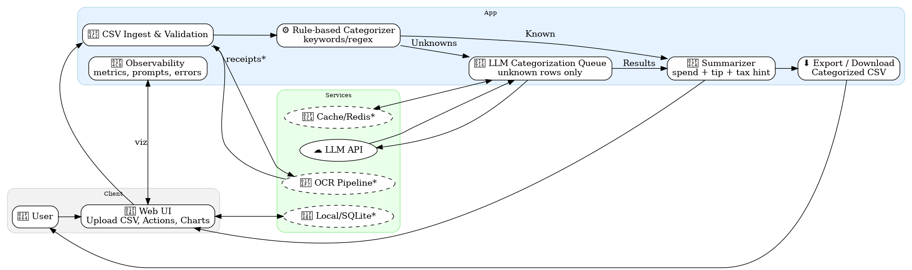
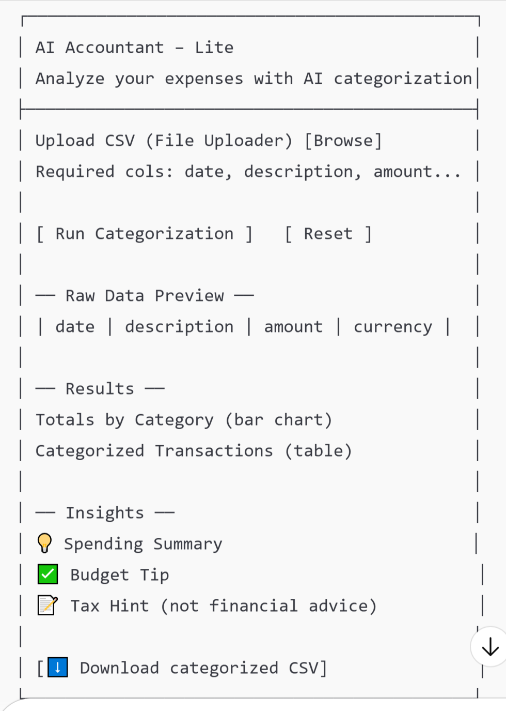
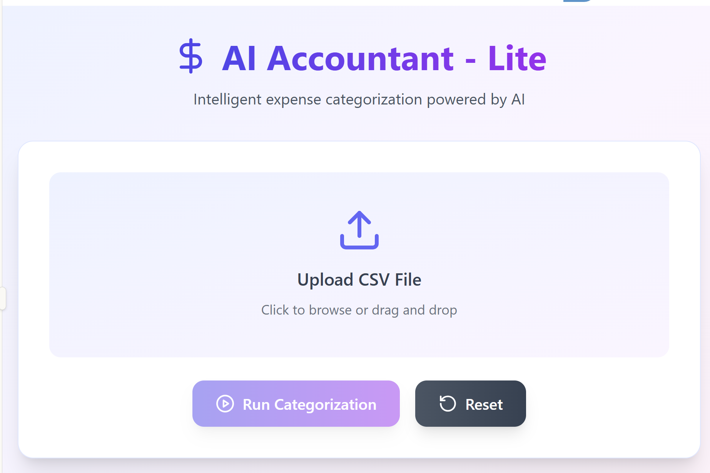

# AI Accountant — Lite (Self-Paced Lab)

> A hands-on, **code-it-yourself** lab that guides participants to build a small financial assistant app that ingests a CSV of transactions, categorizes spending, and generates concise insights.  
> **No starter code is provided below** — you will implement each step yourself.

---

## Step 1 — Learning goals

By the end of this lab, you will be able to:

- Design a minimal **LLM-assisted workflow** for transaction categorization and insights.
- Build a small **data → analyze → visualize** pipeline with a web UI.
- Apply **prompt design, guardrails, and cost controls** in an LLM app.
- Extend the base app with **advanced modules** (OCR, caching, analytics, agent flows).

---

## Step 2 — Audience & time

- **Audience:** Beginner → intermediate developers; advanced stretch modules included.
- **Estimated effort:** 3–6 focused hours (base build) + optional advanced modules.

---

## Step 3 — What you’ll build

A simple web app that:

1. **Ingests** a CSV of transactions.
2. **Categorizes** each row into budget categories (rule-based first, then LLM for the “unknowns”).
3. **Summarizes** spending and surfaces one budget tip + one tax-deduction hint (generic, non-advisory).
4. **Visualizes** category totals and **exports** a categorized CSV.

---

## Step 4 — Constraints

- Build everything **from scratch** during the lab.
- **Do not** use auto-generated code from this brief.
- Keep **personally identifiable financial data** out of prompts; use sample data for the lab.

---

## Step 5 — Prerequisites

- **Language/Runtime:** Python 3.10+ (or equivalent stack).
- **Libraries/Tools:**
  - CSV & data handling (e.g., pandas or native CSV).
  - Simple web UI framework (e.g., Streamlit or Flask/FastAPI + frontend).
  - Dotenv or equivalent for secrets management.
  - HTTP client for API calls.
- **Accounts/Keys:** One LLM API key (OpenAI, Groq, etc.).
- **Dataset:** Sample CSV with `date, description, amount, currency`.

---

## Step 6 — Dataset example

Create a CSV named `transactions.csv` with ~20–50 rows. Suggested columns:

- `date` (YYYY-MM-DD)
- `description` (merchant or memo)
- `amount` (numeric, positive = expense)
- `currency` (e.g., PKR, USD)

Fill with realistic merchant names (e.g., supermarkets, pharmacies, fuel stations, ride-hailing, restaurants, bills).

---

## Step 7 — High-level architecture

### Solution design diagram (Mermaid)



## Step 9 — UI wireframe

 

## Step 9 — Implementation plan

### Phase A — Project skeleton (no LLM yet)

1. **Project setup**

   - Create a project folder and initialize version control (e.g., Git).
   - Set up a minimal Streamlit UI with: title, CSV uploader, and preview area.

2. **CSV ingestion & validation**

   - Implement CSV reading and validation logic.
   - Validate columns: `date, description, amount, currency`.
   - Display clean error messages if validation fails.

3. **Rule-based categorizer**

   - Create a keyword/regex mapping, e.g.:
     - `"PETROLEUM|FUEL"` → Fuel
     - `"CHEMIST|PHARMACY"` → Health/Pharmacy
     - `"STORE|MART|GROCERY"` → Groceries
   - Apply mapping to categorize transactions.
   - Mark uncategorized rows as “Unknown”.

4. **Category totals & charts**
   - Group by category and sum `amount`.
   - Render a bar chart of spending per category.

---

### Phase B — LLM enrichment for “unknowns”

1. **Secrets & configuration**

   - Load API key and provider configuration from environment variables.
   - Add a toggle for provider & model selection.

2. **LLM categorization**

   - Prepare a system prompt that enforces strict JSON output.
   - Prepare a user message listing only the “Unknown” rows.
   - Call the LLM API and request a category for each row.

3. **Guardrails**

   - Validate JSON response.
   - Enforce whitelist of categories; map invalid categories to `Misc`.
   - Retry with stricter instructions if needed.

4. **Merge results**
   - Add LLM categories back into the main table.
   - Store rationale as a new column.

---

### Phase C — Summaries & exports

1. **Generate insights**

   - Compute totals per category.
   - Construct a prompt to produce:
     - 3-line spending summary.
     - 1 budget tip.
     - 1 generic tax hint.

2. **Display results**

   - Show summary text in the UI.

3. **CSV export**
   - Provide download button for a categorized CSV with all columns:
     - `date, description, amount, currency, category, rationale`.

---

### Phase D — Observability & cost controls

1. **Metrics & logs**

   - Track: number of rows processed, unknown rows, API calls, average latency.
   - Log errors with safe context (no sensitive data).

2. **Cost management**
   - Add limit for max rows per batch (e.g., 200).
   - Split into chunks if rows exceed the limit.
   - Optional: estimate token usage before sending prompts.

---

## Step 10 — User testing checklist

- Upload malformed CSV → friendly validation error appears.
- Upload valid CSV → rule-based categories assigned correctly.
- Add unusual merchants → categorized by LLM with rationales.
- Downloaded CSV opens with correct new columns.
- Large CSV (hundreds of rows) → app chunks unknown rows and remains responsive.

---

## Step 11 — Troubleshooting

- **Malformed JSON from LLM:** add stricter prompt, retry once, or fallback to “Misc”.
- **Category drift:** enforce whitelist and map unknown categories.
- **Latency or high costs:** batch unknowns, use caching, or truncate prompts.
- **Privacy concerns:** redact or hash transaction descriptions before sending to LLM.

---

## Step 12 — Advanced modules (for experienced developers)

- **M1 — Merchant cache with Redis**
  Cache results by merchant keyword to avoid repeated LLM calls.

- **M2 — Observability dashboard**
  Visualize usage metrics (rows processed, tokens, latency).

- **M3 — OCR receipts integration**
  Upload receipts (images/PDF), extract text, and match with transactions.

- **M4 — Agentic categorization fallback**
  Use multi-step reasoning to normalize merchants (e.g., “DWATSON ISB” → Pharmacy).

- **M5 — Budget forecasting**
  Aggregate monthly data and forecast next month’s spending per category.

- **M6 — JSON schema validation**
  Apply schema validation to enforce strict structure on LLM output.

- **M7 — Multi-tenant mode**
  Create user workspaces, add per-user quotas and admin usage dashboard.

- **M8 — Tax hint library**
  Blend rule-based tax hints with LLM-generated text.

---

## Step 13 — Deliverables

- Functional UI with:

  - CSV upload
  - Categorization (rules + LLM)
  - Totals chart
  - Spending insights (summary + tips)
  - CSV export

- Guardrails for categories and JSON responses.
- Basic observability (metrics, logging, cost management).
- At least one advanced module for experienced participants.

---

## Step 14 — Evaluation rubric

| Area           | Excellent (3)                        | Good (2)                   | Needs Work (1) |
| -------------- | ------------------------------------ | -------------------------- | -------------- |
| Data handling  | Strong validation & clean error msgs | Some validation            | Crashes/fails  |
| Categorization | Rules + LLM + whitelist enforced     | Rules + LLM, weak controls | Rules only     |
| Insights       | Concise, actionable, useful          | Generic but present        | Missing        |
| Guardrails     | Schema validation + retries          | Some retries               | None           |
| Observability  | Metrics, logs, cost controls         | Basic logs                 | None           |
| UX             | Smooth, clear, helpful UI            | Functional but rough       | Confusing      |
| Advanced       | ≥1 advanced module well built        | Attempted                  | None           |

---

```

```
