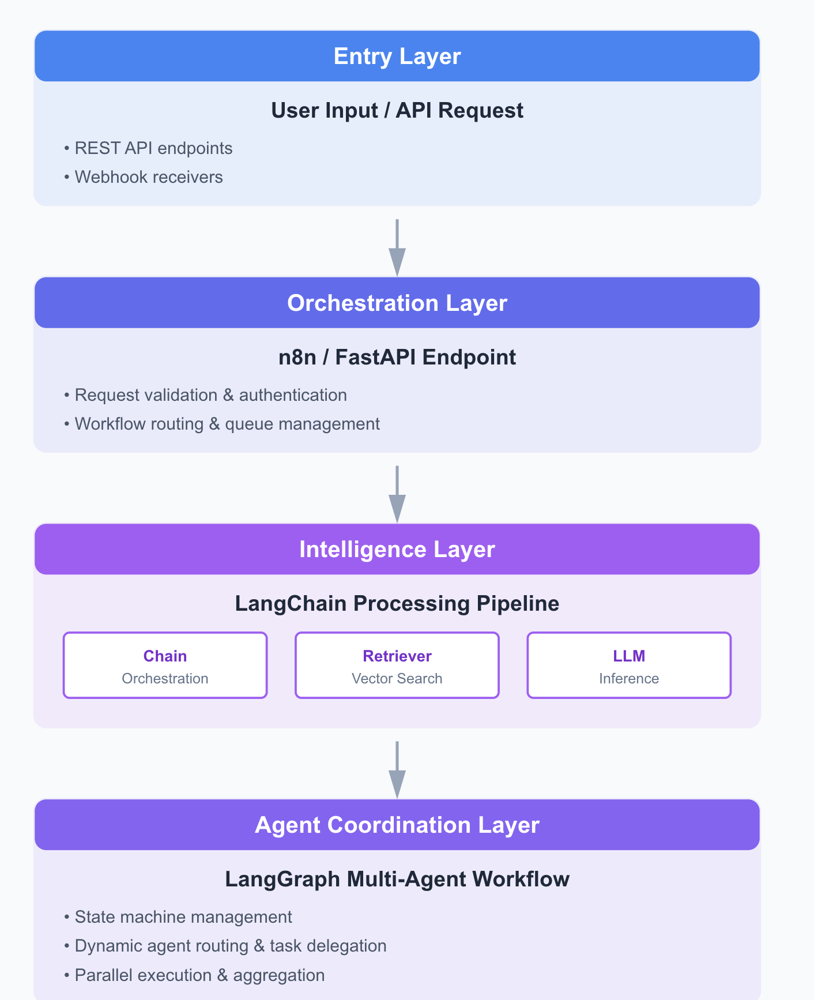

# Week 4 - AI Powered Systems

Week 4 focuses on **designing production-ready and complex AI-powered systems** using everything you've learned in the past three weeks.  
This week is all about **system design, orchestration, and real-world scalability** — how to connect AI components, workflows, and external systems together.

---

## ReCap

Before you continue, make sure you’ve completed the [RoadMap](https://roadmap.sh/r/ai-engineering-6jguf) up to **AI Safety and Ethics** and covered all previous week modules.  
This week builds directly on your knowledge of **LLMs, LangChain, LangGraph, and prompt-based systems**.

---

## Hugging Face

Hugging Face is a central hub for open-source AI models, datasets, and APIs.  
It enables rapid experimentation, fine-tuning, and deployment of models across various domains.

**Pre-trained Models**
- 30,000+ models across NLP, CV, Speech, and Multimodal tasks  
- Native compatibility with PyTorch, TensorFlow, and ONNX  
- Models accessible via the **Transformers library** or **Inference API**

You’ll use Hugging Face to:
- Host or consume open models for custom pipelines  
- Fine-tune lightweight models (DistilBERT, T5, Whisper, etc.)  
- Integrate model APIs into LangChain or n8n workflows  

[Hugging Face](content/hugging-face.md)

---

## n8n

[n8n](https://n8n.io/) is a **visual automation and workflow orchestration platform** that connects AI components with external APIs, databases, and business systems.

Key capabilities:
- Drag-and-drop workflow builder using “nodes”  
- Custom scripting and integration with webhooks, APIs, and AI tools  
- Automate repetitive or multi-step processes without manual coding  
- Combine **AI inference (via LangChain or Hugging Face)** with **data movement and triggers**

Example:
> Run a scheduled workflow → retrieve data → process it through a Hugging Face model → feed results to a LangChain agent → log insights to a database.

---

##  System Design

This is the **core focus** of Week 4 — combining all the tools you’ve learned into **cohesive, production-ready AI systems**.

Modern AI systems are **modular**, **scalable**, and **event-driven**.  
They typically involve several key layers:

| Layer | Purpose | Tools |
|-------|----------|-------|
| **Data Layer** | Ingestion, storage, and retrieval of structured/unstructured data | S3, PostgreSQL, Vector DBs (FAISS, Pinecone) |
| **Model Layer** | Core intelligence (LLMs, embeddings, fine-tuned models) | Hugging Face, OpenAI, Ollama |
| **Orchestration Layer** | Logic, flow, and decision-making between models and data | LangChain, LangGraph |
| **Automation Layer** | Event-driven triggers, scheduling, external API connections | n8n |
| **Interface Layer** | End-user delivery (chatbots, APIs, dashboards) | FastAPI, Streamlit, web clients |

---

### Designing Systems with LangChain & LangGraph

- **LangChain** handles the **composition** of LLM calls, retrieval steps, and tool invocations.  
  Example: build a RAG pipeline where user queries → retriever → LLM → response.

- **LangGraph** introduces **graph-based orchestration**, allowing for:
  - Parallel or conditional task execution  
  - Multi-agent workflows (e.g., one agent summarizes, another validates)  
  - Stateful systems that track context across multiple interactions  

Together, they form the **intelligent orchestration backbone** of your AI system.

Comparison of Langchain Over Regular OpenAI Calls 
[examples](content/langchain-examples.md)

---

### Integrating with n8n

Use **n8n** to automate system-level events and connect non-AI systems:  
- Trigger workflows from user actions or schedules  
- Connect APIs, databases, CRMs, and cloud services  
- Execute LangChain or Hugging Face tasks in response to triggers  
- Send processed outputs back to Slack, Notion, or databases  

Example:
> n8n Trigger → LangChain Chain → Hugging Face Model → Store Output → Notify via Slack

---

### Combining Everything

A practical system architecture might look like this:

This architecture ensures your AI solutions are:
- Modular and reusable  
- Scalable across use cases  
- Maintainable and observable in production  

---

## Resources

- [LangChain Docs](https://python.langchain.com/docs/)
- [LangGraph Docs](https://langchain-ai.github.io/langgraph/)
- [LangSmith Platform](https://smith.langchain.com/)
- [ByteByteGo System Design 101](https://github.com/ByteByteGoHq/system-design-101)
- [8 Moar Important System Design Concepts](https://www.youtube.com/watch?v=BTjxUS_PylA)
- [Multi Agent Systems](https://medium.com/@princekrampah/multi-agent-architecture-in-multi-agent-systems-multi-agent-system-design-patterns-langgraph-b92e934bf843)

