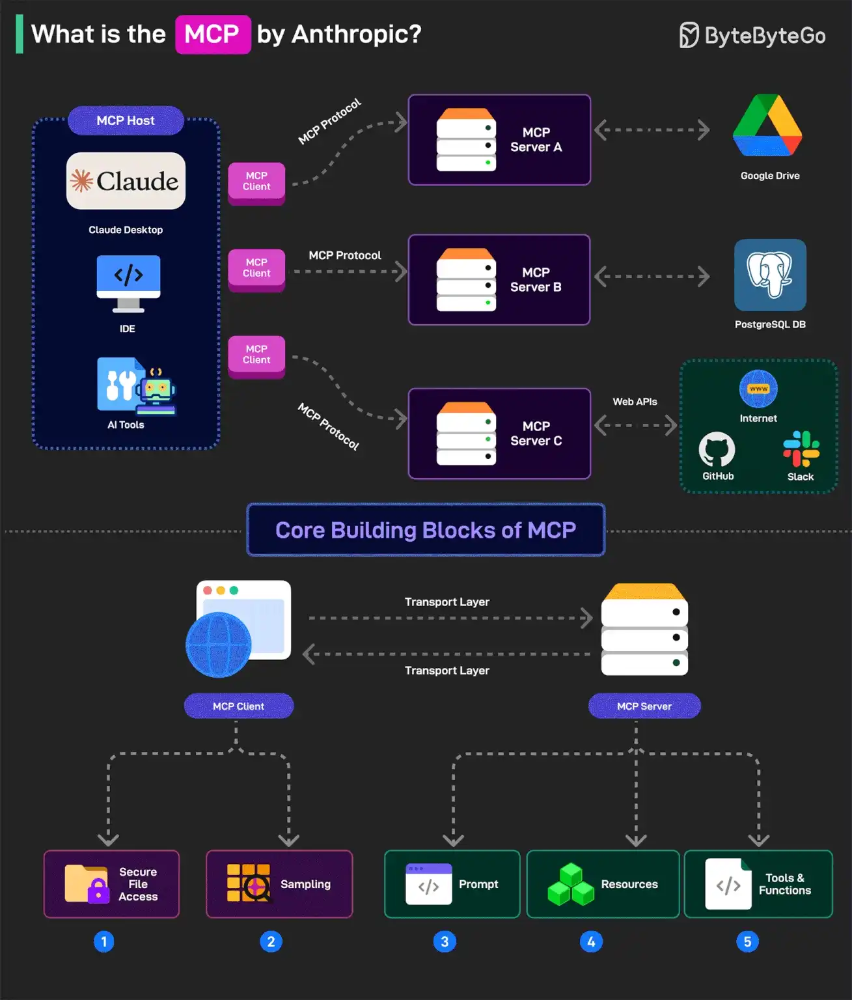
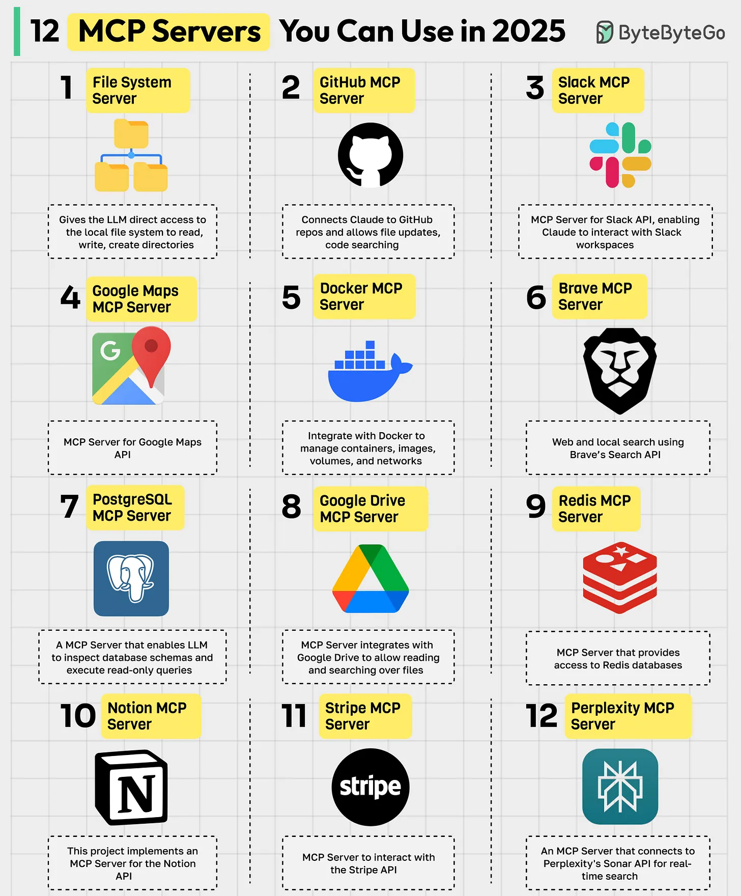

# Model Context Protocol (MCP) — A Deep Dive

## 1. Why MCP Was Developed

Before MCP, LLMs were primarily used with **custom integrations** through SDKs like LangChain or LlamaIndex.
Each application had to manually handle:

* Connecting external data sources
* Managing context and embeddings
* Providing structured tools or APIs for the model

This made scaling, standardization, and security **difficult**.
To address these issues, **Anthropic**, with community input, proposed the **Model Context Protocol (MCP)** — a **standardized way** for LLMs to discover and interact with external data, tools, and APIs **safely and consistently**.

> **Goal:** Create a universal protocol that any LLM, agent, or framework (LangChain, LlamaIndex, etc.) can use to talk to external systems without needing ad-hoc integrations.

---

## 2. What is MCP?

The **Model Context Protocol (MCP)** defines a **standard JSON-RPC-based interface** that allows models and clients to:

* Discover external resources and tools
* Fetch data from external systems
* Execute actions (like API calls or database queries)
* Maintain context in a predictable, safe way

It acts as a **bridge** between:

* **MCP Servers** — expose data or tools
* **MCP Clients** — consume that data or call tools
* **Models / Agents** — reason over those tools

---

## 3. MCP Architecture Overview

### 🧩 Key Components

| Component         | Role                                                                                                                            |
| ----------------- | ------------------------------------------------------------------------------------------------------------------------------- |
| **MCP Client**    | Sends requests to servers (e.g., fetch context, execute a tool). Often embedded in the model runtime or LangChain pipeline.     |
| **MCP Server**    | Exposes resources (files, APIs, DBs, tools). Implements the MCP interface using JSON-RPC over stdin/stdout, WebSocket, or HTTP. |
| **Model Runtime** | The LLM that uses MCP via its client to access context or tools dynamically.                                                    |

### 🔄 Architecture Diagram (Simplified)



---

## 4. MCP Communication Flow

Example of a typical flow:

1. **Client** requests available resources:

   ```json
   {
     "method": "resources/list",
     "params": {}
   }
   ```
2. **Server** responds with metadata of available resources (like APIs or DB tables).
3. **Client** requests a specific resource:

   ```json
   {
     "method": "resources/read",
     "params": { "uri": "file://data/report.csv" }
   }
   ```
4. **Server** responds with the data or an error.

This JSON-RPC interface ensures **consistent structure**, **extensibility**, and **tool discovery**.

---

## 5. MCP Server Example (FastMCP)

**FastMCP** is a lightweight MCP server built using **FastAPI**, designed to make it simple to expose REST endpoints as MCP-compatible services.

### 🧱 Example: MCP Server using FastMCP

```python
from fastmcp import MCPServer, tool

app = MCPServer(name="WeatherServer")

@tool()
def get_weather(city: str):
    # Dummy example
    return {"city": city, "temperature": "28°C", "condition": "Sunny"}

if __name__ == "__main__":
    app.run()
```

* This creates an MCP server exposing a single tool `get_weather`.
* The MCP Client can discover it and invoke it dynamically.

---

## 6. MCP Client Example

A simple Python-based MCP client can be written to query any MCP server:

```python
import requests
import json

payload = {
    "jsonrpc": "2.0",
    "id": 1,
    "method": "tools/call",
    "params": {
        "name": "get_weather",
        "arguments": {"city": "Karachi"}
    }
}

response = requests.post("http://localhost:8000/mcp", json=payload)
print(response.json())
```

---

## 7. Why Use MCP Instead of LangChain/Custom APIs?

| Feature          | Traditional LangChain  | MCP                       |
| ---------------- | ---------------------- | ------------------------- |
| Integration      | Manual per data source | Standardized protocol     |
| Tool Discovery   | Hardcoded              | Dynamic via `tools/list`  |
| Security         | Custom auth            | Standard permission model |
| Extensibility    | Framework-bound        | Framework-agnostic        |
| Deployment       | Application specific   | Reusable MCP Servers      |
| Interoperability | Low (per SDK)          | High (any MCP client)     |

MCP complements LangChain — you can **use MCP servers as tools within LangChain agents**, giving them standardized access to APIs, databases, or context providers.

---

## 8. When to Use MCP

✅ **Use MCP when you need:**

* Consistent access to external tools/data across LLM runtimes.
* Secure, auditable, and shareable context layers.
* Multiple agents needing the same resource integration.
* Standardized tool registration and schema validation.

🚫 **Not necessary when:**

* You’re using a one-off API directly within your code.
* Your application doesn’t need external context or tools.

---

## 9. Popular MCP Implementations & Examples

| Implementation                           | Description                                                        |
| ---------------------------------------- | ------------------------------------------------------------------ |
| **FastMCP**                              | Simple Python FastAPI-based MCP server implementation              |
| **Claude Desktop**                       | Anthropic’s implementation — allows connecting MCP servers locally |
| **LangChain MCP Integration (Upcoming)** | Enables LangChain agents to call MCP servers as tools              |
| **GitHub MCP**                           | Example server exposing GitHub data to LLMs                        |

---

## 10. Resources & References

* 📘 **Official Docs:** [https://modelcontextprotocol.io/docs/getting-started/intro](https://modelcontextprotocol.io/docs/getting-started/intro)
* 🧩 **Architecture Overview:** [https://modelcontextprotocol.io/docs/learn/architecture](https://modelcontextprotocol.io/docs/learn/architecture)
* ⚙️ **FastMCP GitHub Repo:** [https://github.com/modelcontextprotocol/fastmcp](https://github.com/modelcontextprotocol/fastmcp)
* 🧠 **Claude MCP Announcement:** [https://www.anthropic.com/news/model-context-protocol](https://www.anthropic.com/news/model-context-protocol)

---

