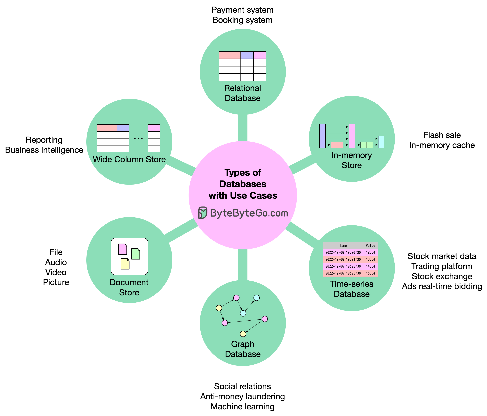

## 🧭 Choosing the Right Database

Selecting the right database depends heavily on **data access patterns**, **consistency requirements**, **scalability needs**, and **query complexity**. Below is a high-level framework inspired by **ByteByteGo** decision models — focused on *trade-offs* and *real-world use cases* rather than hype.

---

### **1. Type of Data**

| Data Type                         | Recommended Database                                     | Notes                                                                                 |
| --------------------------------- | -------------------------------------------------------- | ------------------------------------------------------------------------------------- |
| Structured (tabular, relational)  | **SQL (PostgreSQL, MySQL, MariaDB)**                     | Best for data integrity, ACID transactions, and relational joins.                     |
| Semi-Structured (JSON, key-value) | **NoSQL (MongoDB, DynamoDB, Couchbase)**                 | Flexible schema, easy horizontal scaling, great for rapidly evolving data models.     |
| Unstructured (text, images, logs) | **ElasticSearch, OpenSearch**                            | Ideal for full-text search, log aggregation, and analytics queries.                   |
| High-dimensional embeddings       | **Vector Databases (Pinecone, Weaviate, Qdrant, FAISS)** | Optimized for similarity search, reranking, and AI-driven retrieval.                  |
| Time-dependent metrics            | **Time Series DBs (InfluxDB, TimescaleDB, Prometheus)**  | Designed for fast writes, downsampling, and temporal queries.                         |
| Relationship-heavy data           | **Graph Databases (Neo4j, ArangoDB)**                    | Ideal for social graphs, recommendation systems, and dependency mapping.              |
| Wide, denormalized datasets       | **Wide Column DBs (Cassandra, HBase, ScyllaDB)**         | Optimized for huge datasets, high write throughput, and partition-tolerant workloads. |

---

### **2. Query Patterns**

| Pattern                               | Database Type                  | Reason                                                                               |
| ------------------------------------- | ------------------------------ | ------------------------------------------------------------------------------------ |
| Complex joins, multi-row transactions | **SQL**                        | Enforces integrity and supports relational algebra efficiently.                      |
| Simple lookups by ID or key           | **NoSQL**                      | Key-value access gives low-latency reads and writes.                                 |
| Free-text or fuzzy search             | **ElasticSearch / OpenSearch** | Tokenization and scoring-based ranking.                                              |
| Vector similarity search              | **Vector DB**                  | Uses distance metrics (cosine, dot product, Euclidean) to find “semantic” neighbors. |
| Time-based aggregation                | **Time Series DB**             | Optimized for window functions, retention, and rollups.                              |
| Relationship traversal                | **Graph DB**                   | Enables queries like “friends of friends” in constant time via graph traversal.      |

---

### **3. Scalability and Consistency Trade-offs**

| Need                   | Best Fit                                  | Why                                           |
| ---------------------- | ----------------------------------------- | --------------------------------------------- |
| Strong consistency     | **SQL, NewSQL (CockroachDB, YugabyteDB)** | Guarantees correctness across transactions.   |
| Eventual consistency   | **NoSQL, Wide Column DBs**                | Allows higher availability and scalability.   |
| Horizontal scalability | **NoSQL, ElasticSearch, Wide Column DBs** | Shard-friendly and distributed by design.     |
| Read-heavy workloads   | **ElasticSearch, Time Series DB**         | Query optimization and caching mechanisms.    |
| Write-heavy workloads  | **Cassandra, InfluxDB**                   | High ingestion rate with tunable consistency. |

---

### **4. Decision Heuristics**

| Question                                                              | If "Yes" →       | Database Type |
| --------------------------------------------------------------------- | ---------------- | ------------- |
| Do you need complex transactions and joins?                           | → SQL            |               |
| Do you store flexible, rapidly changing data models?                  | → NoSQL          |               |
| Are you indexing and searching text or logs?                          | → ElasticSearch  |               |
| Do you need to search embeddings or semantic vectors?                 | → Vector DB      |               |
| Are you storing time-dependent data like metrics or IoT readings?     | → Time Series DB |               |
| Do entities have many-to-many relationships (e.g., users, followers)? | → Graph DB       |               |
| Do you handle huge, partitioned, denormalized tables?                 | → Wide Column DB |               |

---

### **5. Example System Designs**

| Use Case              | Optimal Stack                  | Rationale                                            |
| --------------------- | ------------------------------ | ---------------------------------------------------- |
| E-commerce catalog    | **PostgreSQL + ElasticSearch** | Structured product data with text search.            |
| Analytics pipeline    | **Kafka + Cassandra + Spark**  | High write throughput and distributed processing.    |
| Chat or messaging app | **MongoDB + Redis**            | Fast document access and caching.                    |
| Monitoring system     | **Prometheus + TimescaleDB**   | Time-based metrics storage and aggregation.          |
| Recommendation engine | **Neo4j + Pinecone**           | Graph traversal for relationships + semantic search. |
